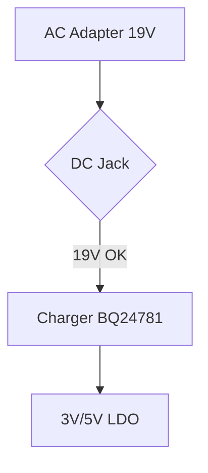

# Инструкция по контенту — Laptop Service (для человека и агента)

> **Принцип: человек/агент пишет только `*.md` файлы в `content/` с оригинальными `jpg/png/webp` рядом. Всё остальное — SEO, sitemap, OG-картинки, `llms.txt`, оптимизация изображений (`avif/webp`), диаграммы Mermaid — генерируется при `npm run build` (SSG). Редактирование — локально через TinaCMS (`npm run dev:tina`) или напрямую `content/**/*.md`, публикация — `git commit` → `git push` → GH Pages.**

---

## 0. Быстрый старт (TinaCMS, локально)

1. **Установка (один раз):** `npm ci` → `npm run dev:tina` (поднимает `tinacms dev -c "astro dev"`). Админка: `http://localhost:4321/admin`, сайт: `http://localhost:4321`.
2. **Создание:** в админке `Сборки / Кейсы / Лента / Отзывы` → `Create New` → заполни поля → внизу поле **Filename** (единственное место для слага, автогенерируется из `Title`/`Author` с транслитом кириллицы, можно поправить латиницей) → `Save`.
3. **Картинки:** в поле `Обложка`/`Галерея` → `Upload` → выбери `jpg/png` (до 4000px) → путь запишется как `/content/<collection>/file.jpg` (colocated рядом с `.md`). Порядок — drag ☰, удаление — 🗑.
4. **Проверка:** `npm run build` (astro check + 29 страниц + 138 картинок `avif/webp`, диаграммы Mermaid — клиентский `mermaid@11`). Пуш: `git add content/ tina/tina-lock.json` → `commit` → `push origin/master` → деплой GH Pages.

**Не трогай:** `public/`, `src/assets/`, `dist/`, `src/data/`, `.obsidian/` (игнорируется). `tina/__generated__/` и `public/admin/` — генерируются, в git не коммить. `tina/tina-lock.json` — **коммить** (нужен для `git pull` на других ПК).

```bash
npm run dev:tina   # Tina + Astro (http://localhost:4321/admin + http://localhost:4321)
npm run dev        # только Astro без админки
npm run build      # проверка + сборка 29 страниц (dist/)
```

---

## 1. Стек и что генерируется при билде

- **SSG Astro 5.18 + `astro:content` + `sharp` + `mermaid@11`** — статика, без БД, `output: static`.
- **Контент:** `content/cases/*.md`, `content/builds/*.md`, `content/threads/*.md`, `content/reviews/*.md` → `src/content.config.ts` (строгая `zod` схема, `image()`).
- **Картинки:** `image()` → `astro:assets` → Sharp → `dist/_astro/*.avif` + `*.webp` + `srcset` (`widths`, `sizes`) + `fallbackFormat="webp"`. Оригиналы не попадают в `dist`. Путь — **абсолютный** `/content/<collection>/file.jpg` (colocated, один уровень).
  - `threads`: `widths=[360,720,1080]` / `[180,360,720]`
  - `cases/builds`: `widths=[400,800,1200]` / `[400,600]`
  - `reviews`: `widths=[300,600]`
- **Диаграммы:** ````mermaid` в теле `*.md` → клиентский `src/components/Mermaid.astro:1` (`mermaid@11`, `theme: dark`, `primaryColor: #19BD9B`, lazy `import()` только если есть `pre[data-language="mermaid"]`) → SVG в `prose` (`not-prose` контейнер `border-chassis-800 bg-chassis-850`).
- **SEO (автомат):**
  - `BaseLayout.astro` — `<title>`, `<meta description>`, `canonical`, `og:*`, `hreflang`, `preload /logo.svg`, `<Mermaid />`
  - `SchemaOrg.astro` — `ElectronicsRepairShop`, `HowTo` (из `solution`), `BreadcrumbList`
  - `astro.config.mjs` — `@astrojs/sitemap` → `dist/sitemap-index.xml` (`filter !/404`)
  - `src/pages/og/[...slug].ts` — `astro-og-canvas` → `dist/og/**/*.png` (бренд `#19BD9B`)
  - `src/pages/robots.txt.ts` + `src/pages/llms*.txt.ts` → `dist/robots.txt`, `dist/llms*.txt`
- **Статика:** `dist/` → Caddy (`Caddyfile` `file_server`, `encode zstd gzip`, `Cache-Control: immutable` для `/_astro/*`).

**Правишь только `content/**/*.md` + картинки рядом + `tina/tina-lock.json`. Всё остальное — `dist/` после билда.**

---

## 2. Структура `content/` (filename = slug)

```
content/
  templates/                 # примеры для ручного копирования (не используются Tina, но актуальны)
    cases_template.md
    builds_template.md
    threads_template.md
    reviews_template.md
  cases/
    asus-tuf-a15-korotkoe-zamykanie-19v.md
    lenovo-legion-5-bga-reballing-rtx3070-1.png
  builds/
    ai-workstation-rtx4090-r9-7950x.md
    ai-workstation-rtx4090-r9-7950x-1.png
  threads/
    2026-08-26-tea-spill.md
    photo_2026-08-26_16-57-10.jpg
  reviews/
    rev-sergey-d.md
    avatars/Сергей Д..webp
```

**Filename = URL:** `content/cases/asus-tuf.md` → `/cases/asus-tuf/`, `content/builds/gaming-1080p-rtx4060.md` → `/builds/gaming-1080p-rtx4060/`. Отдельного поля `slug` **нет** — имя файла и есть слаг. Переименовал файл — сменился URL (делай 301 в `Caddyfile` если уже индексирован).

**Кириллица в Filename:** Tina `tina/config.ts:6` `slugify` транслитерирует (`тестовый заголовок` → `testovyi-zagolovok`, `Сергей Д.` → `rev-sergey-d`), пустого `"-.md"` не бывает. Поле `Filename` внизу формы Tina — единственное место для слага, автозаполняется из `Title`/`Author`, можно поправить латиницей вручную. Агент пишет сразу латинский `content/.../<slug>.md`.

**Картинки:** путь **абсолютный** `/content/<collection>/file.jpg` (например `/content/cases/photo.jpg`), файл лежит рядом с `.md` (`content/cases/photo.jpg`). Tina `tina/config.ts:15` `mediaRoot: "content"` так и сохраняет. Старые `./photo.jpg` уже смигрированы.

---

## 3. Типы контента — поля в `frontmatter` + `body`

### 3.1 `cases` → `/cases` + `/cases/[slug]`

**Frontmatter** (`src/content.config.ts:8`):

| Поле | Тип | Обяз. | Куда попадает | Пример |
|---|---|---|---|---|
| `title` | `string` | **да** | `<title>`, `og:title`, `HowTo name` | `"ASUS TUF Gaming A15: КЗ по 19V"` |
| `device` | `string` | **да** | Подзаголовок, хлебные крошки | `"ASUS TUF Gaming A15 (FA506)"` |
| `category` | `string` | **да** | Бейдж (enum в Tina) | `"Компонентный ремонт платы"` |
| `date` | `YYYY-MM-DD` | **да** | `formatDateRu`, `sitemap` | `2026-08-12` |
| `tags` | `string[]` | нет | `#tag` | `["ASUS","КЗ 19V"]` |
| `heroImage` | `image()` | нет | Обложка `[400,800,1200]` | `/content/cases/hero.jpg` |
| `gallery` | `image[]` | нет | Галерея 1-2 фото | `[/content/cases/photo-01.jpg]` |
| `keySpecs` | `{label,value}[]` | нет | Блок «Параметры» | `label: "Линия" value: "19V"` |
| `schemaType` | `HowTo|Article` | нет | SchemaOrg | `HowTo` |
| `summaryForSocial` | `string` | нет | `meta description` fallback | `"ASUS TUF спасён..."` |
| `problem/diagnosis/solution/result` | `string` | нет | `description` + `HowTo steps` (из `solution`) | `"1. Демонтаж..."` |

**Body:**
```md
---
title: "ASUS TUF..."
device: "ASUS TUF (FA506)"
category: "Компонентный ремонт платы"
date: 2026-08-12
tags: ["ASUS","КЗ 19V"]
heroImage: /content/cases/hero.jpg
gallery: [/content/cases/photo-01.jpg]
---

## Проблема
...
## Диагностика
...
## Решение
1. ...
## Результат
...


```
Рендер в `cases/[slug].astro:110` `<Content />` (`prose`, Mermaid → SVG). Если `problem/solution` пусты — берётся тело.

### 3.2 `builds` → `/builds` + `/builds/[slug]`

| Поле | Тип | Обяз. | Пример |
|---|---|---|---|
| `title` | `string` | **да** | `"Рабочая станция для AI — RTX 4090"` |
| `purpose` | `gaming|ai-work|office|rendering` | **да** | `ai-work` |
| `purposeLabel` | `string` | **да** | `"AI, нейросети и 3D-рендер"` |
| `date` | `YYYY-MM-DD` | **да** | `2026-08-04` |
| `description` | `string` | **да** | `"Для LLM..."` |
| `components` | `object` | нет | `cpu: "Ryzen 9", gpu: "RTX 4090"` |
| `complexity` | `easy|medium|hard` | нет | `hard` |
| `tags` | `string[]` | нет | `["RTX 4090"]` |
| `heroImage/gallery` | `image` | нет | `/content/builds/cover.jpg` |

Тело — доп. markdown + mermaid.

### 3.3 `threads` → лента на `/` (`ThreadsScroller.astro`)

| Поле | Обяз. | Пример |
|---|---|---|
| `handle` | нет | `laptopservice_uz` |
| `date` | **да** | `2026-06-16` |
| `dateLabel` | нет | `"16 июня 2026"` |
| `gallery` | нет | `[/content/threads/01-before-after.jpg]` |
| `alts` | нет | `["До и после"]` 1:1 к `gallery` |

Body = текст поста (1-3 строки, `line-clamp-3`).

### 3.4 `reviews` → `/reviews`

| Поле | Обяз. | Пример |
|---|---|---|
| `author` | **да** | `"Сергей Д."` |
| `source` | нет | `Яндекс Карты` |
| `rating` | нет | `5` |
| `date` | **да** | `2026-03-24` |
| `device` | нет | `"Ноутбук"` |
| `avatar` | нет | `/content/reviews/avatars/Сергей Д..webp` |
| `gallery` | нет | `[/content/reviews/photo.jpg]` |
| `captions` | нет | `["Фото ремонта"]` 1:1 |

Body = текст отзыва.

---

## 4. Картинки

- **Куда:** рядом с `.md` (`/content/<collection>/file.jpg`), путь **абсолютный** `/content/...` (Tina так сохраняет).
- **Формат:** `jpg/png/webp` оригинал до 4000px. Sharp → `dist/_astro/*.avif|webp`.
- **В Tina:** `Обложка`/`Галерея` → `Upload` → drag ☰, delete 🗑. Порядок в `gallery` = порядок в карусели.
- **У агента:** `heroImage: /content/cases/photo.jpg`, `gallery: [/content/cases/photo-01.jpg, /content/cases/photo-02.jpg]`, `alts`/`captions` строго 1:1.

**Не делай:** `public/`, `src/assets/`, `dist/`.

---

## 5. Диаграммы Mermaid

В любом `content/**/*.md` теле:

````md

````

Рендер — `src/components/Mermaid.astro` (тёмная тема `#19BD9B` на `chassis-850`, responsive, lazy).

---

## 6. Что генерируется из `.md`

| Куда | Как | Поля |
|---|---|---|
| **Главная** `/` | `index.astro:14` `getCollection` + `ThreadsScroller` | `title, gallery, purposeLabel, device` |
| **Списки** `/cases` `/builds` `/reviews` | `getCollection` + `CaseCard/BuildCard` | все |
| **Страницы** `/cases/[slug]` `/builds/[slug]` | `getStaticPaths` `entry.id.replace(/.md$/, "")` → `dist/.../index.html` | `title, device, category, body, gallery, keySpecs` |
| **SEO** | `BaseLayout` `title/description/canonical/og`, `SchemaOrg` `HowTo` из `solution` | `title, problem/summaryForSocial` |
| **OG** | `og/[...slug].ts` `astro-og-canvas` | `title, description` |
| **Sitemap/Robots/llms** | `astro.config.mjs` `@astrojs/sitemap`, `robots.txt.ts`, `llms*.txt.ts` | `id, date` |

**Filename = slug.** Поменял имя файла — старый URL → 301 в `Caddyfile`.

---

## 7. Добавление / редактирование

### Человек (TinaCMS, локально)

1. `npm run dev:tina` → `http://localhost:4321/admin` → коллекция → `Create New`.
2. Заполни `Title`/`Device`/`Category`/`Date` → `Filename` внизу автозаполнится транслитом, поправь латиницей если нужно.
3. `Обложка`/`Галерея` → Upload / drag. `Alts`/`Captions` 1:1.
4. Тело — `## Проблема` и т.д. + ```mermaid` при необходимости.
5. `Save` → `git status` → `git add content/ tina/tina-lock.json` → `commit` → `push`.

### Агент

```json
{
  "file": "content/cases/<filename>.md",
  "frontmatter": {
    "title": "ASUS TUF Gaming A15: КЗ по 19V (60-80 симв)",
    "device": "ASUS TUF Gaming A15 (FA506)",
    "category": "Компонентный ремонт платы",
    "date": "2026-08-12",
    "tags": ["ASUS","КЗ 19V"],
    "heroImage": "/content/cases/photo.jpg",
    "gallery": ["/content/cases/photo-01.jpg"],
    "keySpecs": [{"label":"Линия","value":"19V"}],
    "schemaType": "HowTo"
  },
  "body": "## Проблема\n...\n```mermaid\ngraph TD\nA-->B\n```\n",
  "images": [{"path":"content/cases/photo.jpg","maxWidth":4000}]
}
```
Пишет только `content/**/*.md` + оригиналы рядом, `tina/tina-lock.json` коммитится.

### Редактирование / удаление

- Открой файл в `tina/admin` или `content/.../*.md`, правь, `Save`.
- Переименовал файл → сменился URL.
- Удалил файл → страница исчезнет из `sitemap`/`og` после билда.

### Проверка

```bash
npm run build   # astro check + 29 страниц, Tina не участвует (static)
# Ошибки frontmatter/картинок покажет astro check
```

Частые ошибки: `image not found` → путь не `/content/...` или файл не рядом с `.md`; `InvalidContentEntryDataError` → `category/purpose` опечатка (выбирай из списка Tina).

---

## 8. Деплой

`Dockerfile` `node:22-alpine` `npm run build` → `caddy:2-alpine` `dist/`. `Caddyfile` `encode zstd gzip`, `Cache-Control: immutable` для `/_astro/*`.

Пуш в `master` → GH Actions `npm ci` → `npm run build` → `dist` → GH Pages (static, без `tina` runtime).

---

## 9. Чек-лист

- [ ] Файл `content/{cases,builds,threads,reviews}/<slug>.md` (латиница, `slugify` из `Title`)
- [ ] `title`, `date`, `device`/`category`/`purpose` заполнены
- [ ] `heroImage`/`gallery` указывают на `/content/...` рядом с `.md`
- [ ] `alts`/`captions` 1:1 к `gallery`
- [ ] `npm run build` без ошибок, `dist/sitemap-index.xml` содержит URL
- [ ] Проверил `/cases/<slug>`, `/builds/<slug>` + Mermaid

---

## 10. Где что лежит

| Что | Файл | Трогать? |
|---|---|---|
| Кейсы | `content/cases/*.md` + `*.jpg` | **да** |
| Сборки | `content/builds/*.md` | **да** |
| Лента | `content/threads/*.md` | **да** |
| Отзывы | `content/reviews/*.md` | **да** |
| Шаблоны | `content/templates/*.md` | копировать (пример) |
| Tina схема | `tina/config.ts` | нет (транслит Filename) |
| Коллекции | `src/content.config.ts` | нет |
| Mermaid | `src/components/Mermaid.astro` | нет |
| SEO/layout | `src/layouts/BaseLayout.astro` | нет |
