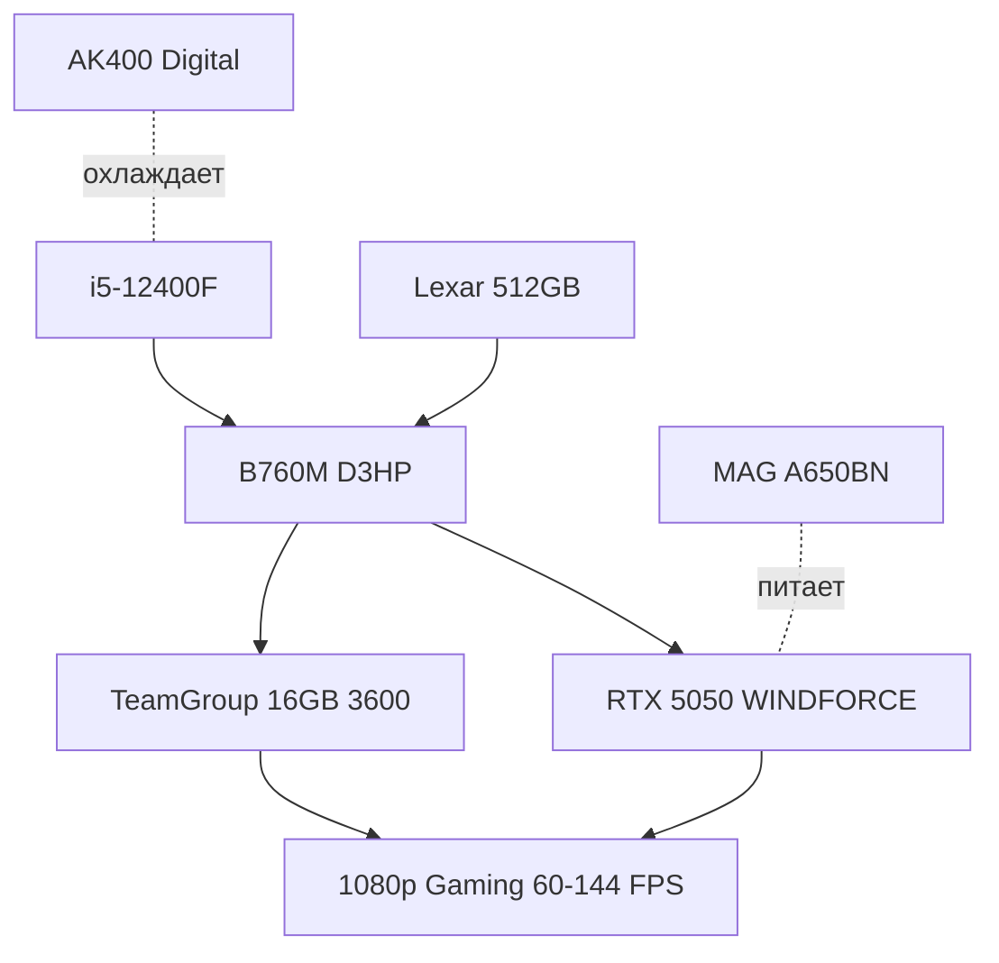

## Кому подойдёт эта сборка в Узбекистане

Как говорит Александр: *«У кого деньги есть и кто в игры играет»* — это честная бюджетная сборка для геймеров Ташкента, которым нужен стабильный 1080p без переплаты. Подходит для **CS2, Dota 2, Fortnite, GTA V, Cyberpunk 2077 (средние-высокие), Hogwarts Legacy** на 60-144 FPS. Все комплектующие — новые, оригинальные, в наличии у нас.

Собирал наш специалист Александр — мастер сервисного центра, который ежедневно ремонтирует платы, знает слабые места дешёвых сборок и поэтому собрал без компромиссов.

## Что внутри — полный список

| Комплектующее | Модель | Почему выбрано |
|---|---|---|
| **CPU** | Intel Core i5-12400F | 6 ядер Alder Lake без переплаты за iGPU — вся мощность в игры. Хватает для RTX 5050 без бутылочного горлышка |
| **Материнская плата** | Gigabyte B760M D3HP | DDR4 — доступнее DDR5 в Ташкенте, 4 слота RAM, M.2 PCIe 4.0, надёжный VRM для i5 |
| **ОЗУ** | TeamGroup 16GB (2×8) DDR4 3600 | Dual Channel + 3600 МГц — топ для DDR4, прирост FPS в играх vs 3200. 16GB достаточно для 2026 года |
| **Видеокарта** | Gigabyte RTX 5050 8GB WINDFORCE OC | Новинка 50-й серии, 8GB GDDR6 хватает для Full HD с DLSS 3, холодная и тихая турбина WINDFORCE |
| **Охлаждение** | DeepCool AK400 Digital SE | Башня с дисплеем температуры — контроль прямо на корпусе, 4 теплотрубки держат i5-12400F <70°C |
| **SSD** | Lexar LNM620 512GB | NVMe 3.0 с DRAM-кешем, быстрая загрузка игр и системы, место под 3-4 AAA-игры |
| **БП** | MSI MAG A650BN 650W | 650W Bronze с запасом 150-200W для апгрейда до RTX 5060 Ti, тихий 120мм, защита OVP/OCP |
| **Корпус** | DeepCool CG380 3F | mATX с 3 вентиляторами в комплекте — сразу готовый продув, сетчатая передняя панель |

> **Итоговая цена с нашей сборкой — около $1000** (округлили вместе с работой). Все коробки и гарантии сохраняем.

## Нюансы выбора от Александра — без слабых мест

> *«Выбирал чтобы не было слабых мест, и бюджетно, но при этом всё из оригинальных комплектующих и новых»* — Александр

1. **Баланс, а не маркетинг.** i5-12400F + RTX 5050 — идеальная пара: процессор не душит видеокарту, видеокарта не простаивает. Не стали брать i3 с RTX 5060 — был бы дисбаланс.
2. **DDR4 осознанно.** В Узбекистане DDR5 всё ещё дорога, а TeamGroup 3600 — максимум для DDR4. Разница в играх vs DDR5 5200 — 3-7%, а экономия $60-80 ушла в нормальный БП и охлаждение.
3. **Питание и охлаждение — не экономили.** AK400 Digital SE и MSI 650W — не «комплектные затычки», а рассчитанный запас. Дешёвый БП — главный риск для RTX, мы его исключили.
4. **Оригинал и новое.** Никаких «восстановленных» или серых поставок — только официальные Gigabyte/MSI/Lexar с гарантией. Как в ремонте — лучше один раз качественно.

## Апгрейд в будущем — что можно усилить

> *«Видяху до 5060 Ti, проц наверное i5-14400F, ну это бюджетка, на DDR4 но топовая память»* — Александр

- **Видеокарта → RTX 5060 Ti 8/16GB** — лучший следующий шаг. БП 650W уже готов, корпус вместит 2.5-слотовую карту.
- **Процессор → i5-14400F / i5-14600** — прирост 10-15% в играх, B760M D3HP поддерживает 14-е поколение без замены платы (обновим BIOS).
- **ОЗУ → 32GB (2×16)** — если стримы или тяжёлые игры 2027 года. Сейчас 3600 МГц уже топ, просто добавить планки.
- **SSD → +1TB NVMe** — второй M.2 слот свободен, добавим без переустановки системы.
- **Что не стоит менять:** DDR4 на DDR5 — потребует замены платы и памяти целиком, выгоды мало для 1080p.

## Почему собирать у нас

- Собирает мастер, который ремонтирует ноутбуки и знает, что ломается через год.
- Тестируем стресс-тестами и играми перед выдачей, даём отчёт.
- Кабель-менеджмент, продув и термопаста — как для себя.
- Гарантия и поддержка в Ташкенте — не надо везти в коробке из-за рубежа.

Хочешь такую же? Пиши — адаптируем под твой бюджет и игры. Можно собрать «как у Александра» 1 в 1 или заменить корпус/память под вкус.

