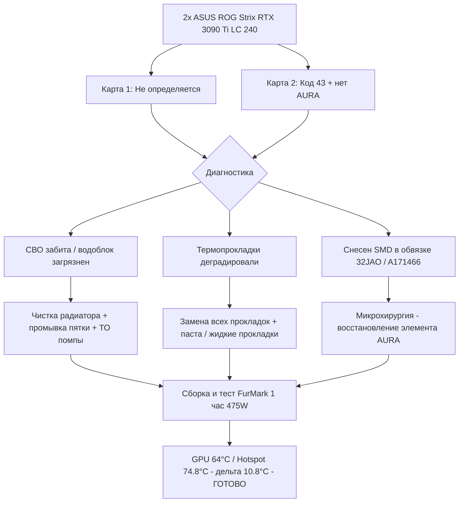

## Вводная: две топовые карты на грани списания

К нам в [LaptopService.uz](https://laptopservice.uz/) — сервисный центр в Ташкенте — одновременно поступили две флагманские видеокарты **ASUS ROG Strix GeForce RTX 3090 Ti LC 240 OC Edition** — редкая модель со штатной системой водяного охлаждения 240 мм (AIO). Карты построены на чипе **GA102-350-A1**, несут **24 ГБ GDDR6X** и штатно потребляют под **480 Вт**.

> Характеристики эталона: [Спецификация ASUS ROG Strix GeForce RTX 3090 Ti LC OC Edition](https://rog.asus.com/graphics-cards/graphics-cards/rog-strix/rog-strix-rtx3090ti-o24g-gaming-model/spec/) — для понимания класса железа и его аппетитов к охлаждению.

**Симптомы при поступлении были разными, но корень один — отложенное обслуживание и следы неквалифицированного вмешательства:**

*   **Карта №1 — «Невидимка»:** Система её вообще не видела. Нет инициализации, чёрный экран, не определяется в BIOS/Диспетчере устройств. Типичная картина для проблем по питанию, PCIe-линии или глубокого перегрева с деградацией интерфейса.
*   **Карта №2 — «Код 43»:** Определяется в Windows с жёлтым восклицательным знаком — *Код ошибки 43* (драйвер остановлен из-за неисправности устройства). Дополнительно — не работала фирменная подсветка **ASUS AURA Sync**. При осмотре под микроскопом найден снесённый SMD-компонент в обвязке контроллера подсветки.

---

## Диагностика

### 1. Система охлаждения — критическое загрязнение

Обе карты с пробегом и явными следами эксплуатации без профилактики. Радиаторы СВО на 240 мм забиты плотным «войлоком» из пыли. У водянки это критично: соты теряют эффективную площадь, хладагент не остывает, помпа работает на износ, а GPU уходит в троттлинг.

### 2. Деградация термоинтерфейсов

На картах с 24 ГБ GDDR6X и массивным VRM (силовые фазы под 475 Вт) термопрокладки — не расходник «на сдачу». Штатные прокладки высохли, «потекли» маслом, потеряли толщину и эластичность. На VRM и памяти — перегрев, на GPU — эффект «pump-out» у пасты. Отсюда и Код 43 у второй карты: нестабильность обвязки VRAM/GPU при перегреве.

### 3. Предыдущий неквалифицированный ремонт

На второй карте в районе контроллера подсветки **AURA 32JAO (A171466)** отсутствовал SMD-компонент — снесён при неаккуратной разборке/чистке. Из-за него не работала RGB-подсветка — мелочь для майнера, но маркер отношения к плате.

### 4. Водоблок («пятка») и помпа

Внутри водоблока — налёт и следы старого хладагента. Пятно контакта («пятка») требовало глубокой чистки, иначе даже новая паста не спасёт дельту Hotspot. Помпа — обслуживание и проверка циркуляции.

> **Подробный тред про чистку пятки и обслуживание водоблока — в нашем Threads:** [Обсуждение обслуживания СВО и чистки водоблока в Threads](https://www.threads.com/@laptopservice_uz/post/DcoSkzHAi-O)

---

## Решение: комплексное ТО + микрохирургия платы

Карты были полностью разобраны до платы (PCB). Все работы — под микроскопом, с контролем толщин и термопрофиля.

1.  **Чистка и обслуживание СВО:**
    *   Демонтаж AIO, слив и промывка контура, чистка водоблока и пятки до зеркала
    *   Продувка и мойка радиатора 240 мм, ультразвуковая чистка вентиляторов, смазка/проверка подшипников
    *   Заправка, прокачка, проверка герметичности и работы помпы

2.  **Замена всех термоинтерфейсов:**
    *   Премиальные термопрокладки строго подобранной толщины на все чипы **GDDR6X**, мосфеты и дроссели VRM
    *   Жидкие прокладки там, где требуется компенсация зазора
    *   Топовая термопаста на кристалл **GA102-350-A1** (нанесение без пустот, контроль отпечатка)

    > Только на качественные расходники для *одной* такой карты уходит **около $200** — термопрокладки, жидкие прокладки, паста, обслуживание помпы. Экономия здесь = повторный перегрев через 2–3 месяца.

    > **Тред про стоимость расходников и почему нельзя тянуть с ТО:** [Обсуждение стоимости расходников $200 в Threads](https://www.threads.com/@laptopservice_uz/post/Dcna-tgAgli)

3.  **Восстановление электроники:**
    *   На карте №1 — восстановление цепей инициализации/питания (замер линий PCIe 12V, поиск КЗ/обрыва, пропайка).
    *   На карте №2 — ювелирное восстановление снесённого SMD-элемента в обвязке **AURA 32JAO / A171466** под микроскопом, проверка подсветки.

4.  **Сборка и контроль:**
    *   Правильная последовательность затяжки водоблока (крест-накрест, без перекоса)
    *   Проверка отпечатка пасты и прижима прокладок, сборка кожуха и бэкплейта

---

## Фотоотчёт: 7 шагов от грязи к идеалу

### Фото 1 — Грязный радиатор СВО 240 мм

*Внешний радиатор СВО (240 мм) забит пылью и грязью. В системах водяного охлаждения забитые соты радиатора критически снижают эффективную площадь рассеивания тепла, что приводит к перегреву хладагента, помпы и самого графического процессора.*

### Фото 2 — Загрязнённый кожух и подсветка до чистки

*Внутренняя сторона пластикового кожуха и каналы подсветки до чистки. Пыль и следы деградировавших термопрокладок/масла проникают во все внутренние отсеки видеокарты, снижая надежность работы электроники.*

### Фото 3 — Вентиляторы до обслуживания

*Вентиляторы охлаждения радиатора до обслуживания. На лопастях скопился плотный слой пыли и налета, вызывающий дисбаланс, повышенный шум при работе и падение воздушного потока.*

### Фото 4 — Чистые вентиляторы в сборе после УЗ-ванны

*Результат ультразвуковой чистки и обслуживания вентиляторов. Лопасти и рамки полностью очищены, подшипники проверены. Восстановлен первозданный вид и максимальная производительность продува.*

### Фото 5 — Нанесение термоинтерфейса на PCB

*Процесс полной замены термоинтерфейсов на печатной плате (PCB). Установлены премиальные термопрокладки строго рассчитанной толщины на чипы памяти GDDR6X, зоны VRM (силовые ключи и фазы питания). На кристалл GPU GA102-350-A1 нанесена топовая термопаста. Стоимость высококачественных расходников для такой карты может достигать $200, но это гарантия долговечности.*

### Фото 6 — Микрохирургия: восстановлен сбитый элемент AURA

*Микрохирургия на печатной плате: на второй видеокарте предыдущими мастерами или при неаккуратной разборке был снесён SMD-компонент в обвязке контроллера AURA (32JAO / A171466). Из-за этого не работала фирменная RGB-подсветка. Элемент восстановлен под микроскопом, работоспособность подсветки полностью возвращена.*

### Фото 7 — Часовой отчёт FurMark: температуры и мощность

*Результаты часового стресс-теста в FurMark после ремонта и ТО: энергопотребление ~475 Вт (99% TDP), частота GPU ~1755 МГц, температура GPU 64°C, Hotspot 74.8°C (дельта всего ~10.8°C — идеальный показатель), ~297 FPS @ 1920×1080, 100% стабильность без сбоев и артефактов.*

---

## Почему нельзя откладывать профилактику (для майнеров, ИИ-инженеров и геймеров)

RTX 3090 Ti LC — это 475 Вт в пике на одной плате. GDDR6X греется сильнее обычной GDDR6, а VRM при майнинге/рендере/обучении моделей работает 24/7. Отложенное ТО = лавина:

*   Высыхают прокладки → перегрев памяти 100–110°C → ошибки и **Код 43**
*   Растёт дельта **Hotspot – GPU Core**: норма 10–15°C, тревожно >20°C, критично >25°C
*   Помпа AIO деградирует без чистки — падает проток, растёт температура хладагента, появляется шум
*   Пыль в радиаторе и на вентиляторах → падение потока → троттлинг и вылеты драйвера

**На что смотреть владельцу RTX 3090 (Ti) / 4080 / 4090 с водянкой или массивным воздухом:**

1.  GPU Hotspot в GPU-Z / HWInfo — если дельта с GPU Temp >15–18°C под нагрузкой — пора на ТО
2.  Температура памяти GDDR6X >95°C в играх/рендере — прокладки уже не работают
3.  Шум помпы/вентиляторов, вибрация, падение FPS без причин
4.  Артефакты, вылеты с Код 43, не определяется после перегрева

**Регламент профилактики от LaptopService.uz: раз в 12–18 месяцев** — чистка радиаторов/водоблока, замена всех прокладок и пасты, проверка помпы и герметичности. Для ферм и ИИ-стендов — раз в 12 месяцев.

---

## Результат: часовой FurMark на полной мощности

После сборки обе карты прошли **часовой стресс-тест FurMark** на полной нагрузке — это жёстче игр и майнинга по постоянству нагрева.

| Параметр | Значение |
|---|---|
| **Board Power Draw** | **~475 Вт (99% TDP)** |
| **Частота GPU** | **~1755 МГц** (стабильный буст без просадок) |
| **Температура GPU (Core)** | **64 °C** |
| **Температура Hotspot** | **74.8 °C** |
| **Дельта Hotspot – Core** | **~10.8 °C — идеал** (признак отличного прижима и пасты) |
| **Разрешение / FPS** | **1920×1080 / ~297 FPS** |
| **Стабильность** | **100% — без артефактов, вылетов, троттлинга** |

**Итог:** обе карты полностью восстановлены, обслужены премиальными расходниками, подсветка AURA возвращена, температуры — как у новой. Клиент получил гарантию на работы и рекомендации по профилактике.

---

## Обращайтесь в LaptopService.uz

Если ваша флагманская карта стала греться, шуметь, выдавать Код 43 или перестала определяться — не ждите, пока «само пройдёт». Чем раньше сделать ТО, тем дешевле ремонт.

*   **Сервисный центр LaptopService в Ташкенте:** [https://laptopservice.uz/](https://laptopservice.uz/) — диагностика, компонентный ремонт плат, BGA, обслуживание СВО и воздуха
*   **Мы в Threads:** [чистка пятки водоблока DcoSkzHAi-O](https://www.threads.com/@laptopservice_uz/post/DcoSkzHAi-O) и [почему расходники — $200 Dcna-tgAgli](https://www.threads.com/@laptopservice_uz/post/Dcna-tgAgli)
*   **Спецификация эталона:** [ASUS ROG Strix RTX 3090 Ti LC OC Edition](https://rog.asus.com/graphics-cards/graphics-cards/rog-strix/rog-strix-rtx3090ti-o24g-gaming-model/spec/)

Приносите карту на бесплатную диагностику на ул. Паркент — вернём ей заводскую прохладу и стабильность.

